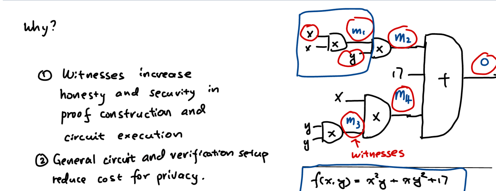
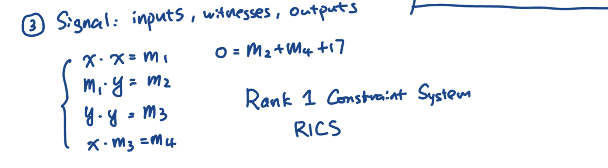
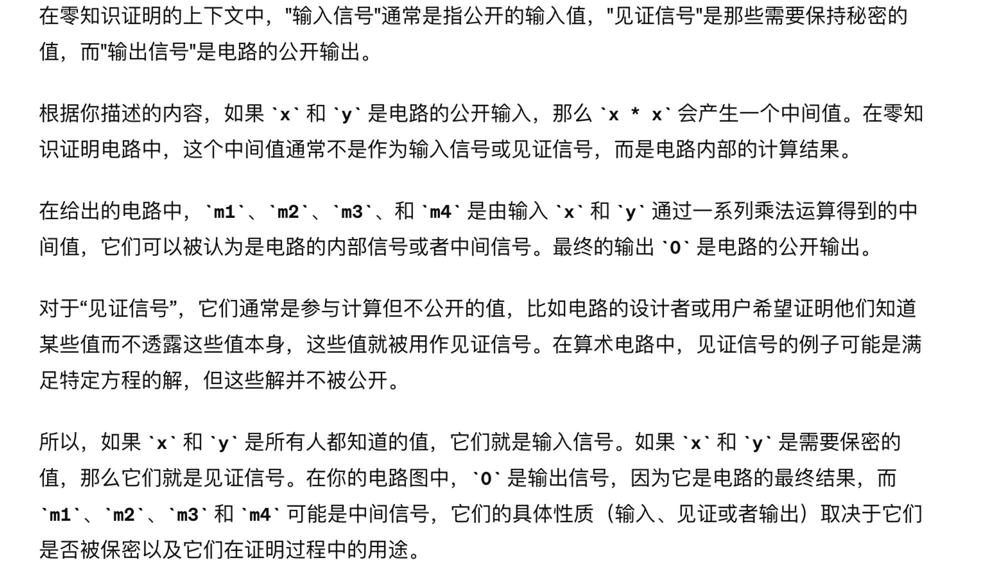

# Circom

一个用于创建零知识证明的编程语言和工具框架。它允许开发者创建可以验证复杂逻辑而无需泄露原始数据的电路。在区块链和加密货币的领域中，零知识证明通常用于增加交易的隐私性，同时保持去中心化网络的安全性和透明性。使用 Circom 开发的电路可以编译成零知识证明，确保数据的完整性和机密性。

- 首先提到了“见证者”（Witnesses）的概念，这在零知识证明中是很关键的。见证者是用于提高证明构建和电路执行的诚信度与安全性的私密输入。这意味着这些值是知道秘密信息的人提供的，但不会在证明过程中向验证者公开。

- 第二点强调了通用电路设置和验证的概念，这有助于降低隐私保护的成本。在零知识证明的上下文中，"一般化电路"可能指的是一个灵活的电路，它能够处理各种不同类型的计算和验证任务，而不是专为一个特定任务定制的。因为一般化的电路可以重用于多种场合，所以它可以降低创建和维护多个特定用途电路的成本。而“验证设置”可能指的是在证明和验证过程中所使用的协议和技术框架。如果这个设置是高效且优化的，它可以减少执行验证所需的计算资源和时间，从而降低保护隐私的总体成本。

### Circom 中的输入信号，见证信号，输出信号

