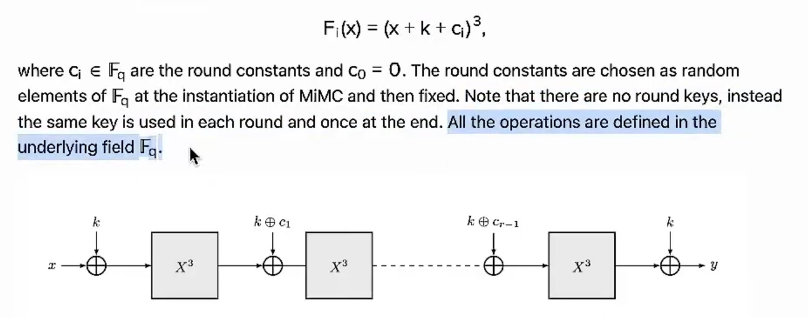
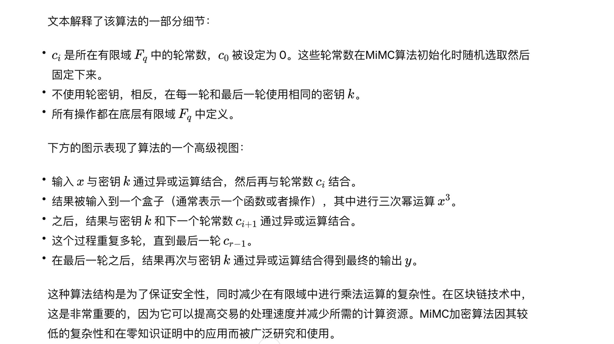
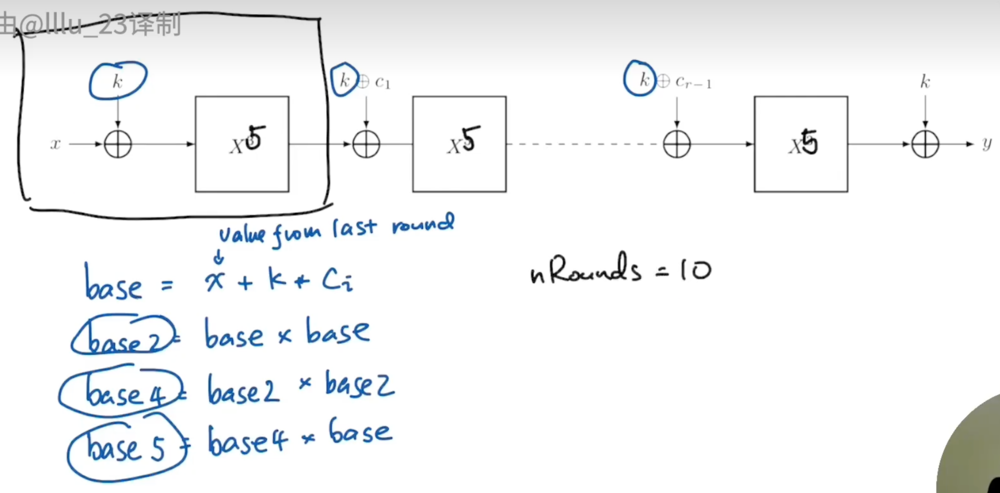

# MiMC 哈希函数电路

MiMC（Merkle-Damgård Input-Merkle-Damgård）哈希函数电路是一种特殊设计的哈希函数，主要用于零知识证明（ZKP）应用，特别是在使用零知识证明的情况下。MiMC 的设计简单，它通过迭代一个函数 F(x) = x^3 并添加子密钥来工作。这种设计概念最早由 Nyberg 和 Knudsen 在 1990 年代提出，被称为 KN-Cipher。MiMC 的简单性使其成为许多应用的首选，尽管后来提出了更高效的 ZK-friendly 哈希函数，但 MiMC 仍然被广泛使用，因为它被认为比其他 ZK-friendly 哈希函数更成熟 3。

MiMC 哈希函数电路的设计目标是在保持安全性的同时，提供一个低多项式复杂度的结构，这对于需要在零知识证明中使用的应用来说是有利的。这种低复杂度的特性使得 MiMC 在处理大量数据时，能够在保持高效性的同时，提供足够的安全性 4。

MiMC 哈希函数电路的一个重要应用是在零知识证明（ZKP）中，特别是在使用零知识证明的情况下，如在生成证明和验证证明时。MiMC 的设计使其成为实现这些应用的理想选择，因为它能够在保持高效性的同时，提供足够的安全性。此外，MiMC 的简单性和低复杂度的特性使得它在实现和优化零知识证明应用时，具有显著的优势 234。

总的来说，MiMC 哈希函数电路是一种简单、安全且适用于零知识证明应用的哈希函数，它通过迭代一个简单的函数并添加子密钥来工作，以实现低多项式复杂度的结构。这种设计使得 MiMC 成为许多零知识证明应用的首选，尽管后来提出了更高效的 ZK-friendly 哈希函数，但 MiMC 仍然被广泛使用，因为它的简单性和成熟性。

