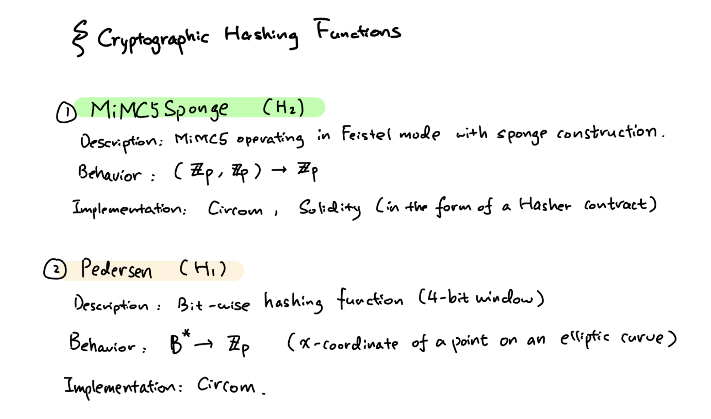
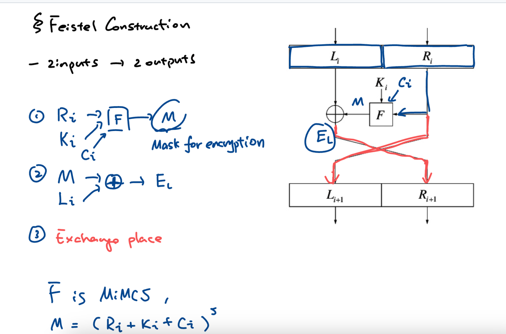
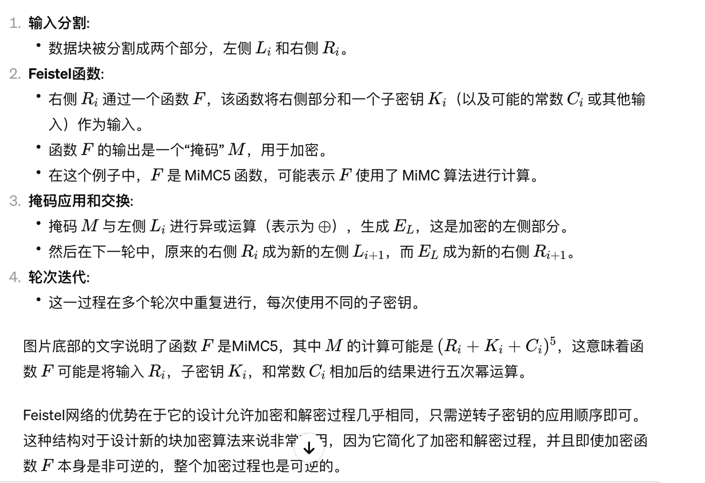
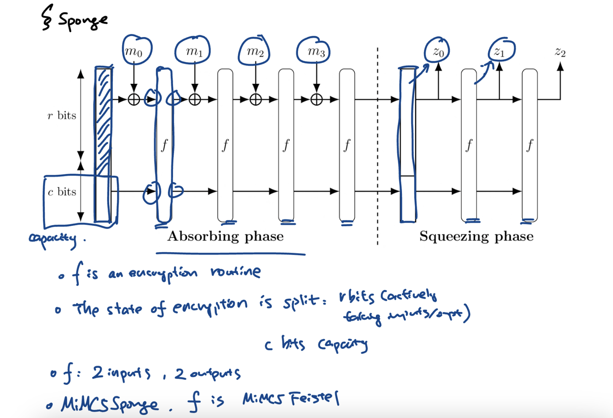
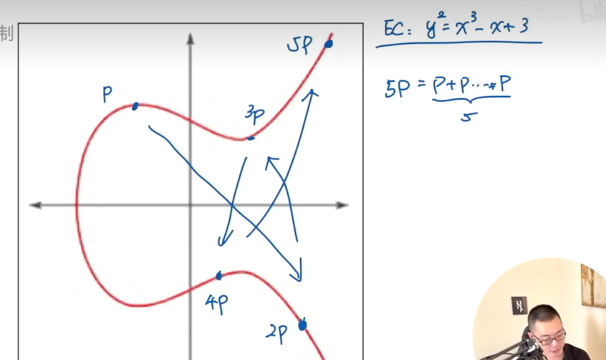
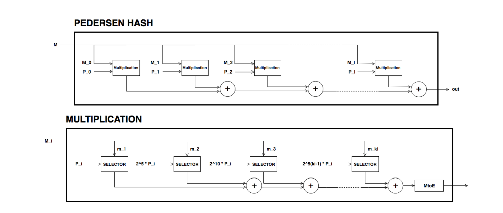
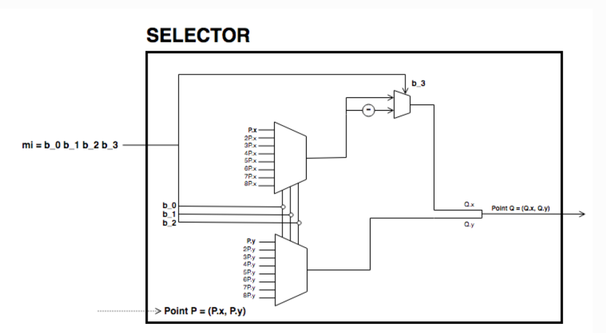

# Pedersen 和 MiMCSponge 哈希函数

图片内容概述了两种密码学哈希函数：MiMC-Sponge（H2）和 Pedersen（H1）。

1. **MiMC-Sponge (H2)**:
   - **描述**: MiMC-Sponge 是一个基于 MiMC（最小多项式哈希）操作的哈希函数，它在 Feistel 网络结构上使用海绵构造。这种结构用于密码学哈希和加密。
   - **行为**: 它接受两个有限域 Zp 上的元素作为输入，并输出一个 Zp 域中的元素。
   - **实现**: 在 Circom（可能是指用于 zk-SNARKs 的电路编译器）和 Solidity（以太坊的智能合约语言）中实现，通常以哈希器合约的形式出现。
2. **Pedersen (H1)**:
   - **描述**: Pedersen 哈希是一种逐位（bit-wise）哈希函数，通常用于区块链技术，它使用了椭圆曲线的特性来增强安全性。
   - **行为**: 它可以将一个二进制字符串（B\*）哈希到有限域 Zp 上的一个元素，这个元素是椭圆曲线上点的 x 坐标。
   - **实现**: 同样在 Circom 中实现。

这两种哈希函数在区块链和密码学中非常重要，特别是在需要隐私和安全性的场景，如零知识证明和隐私币（如 Zcash）中。MiMC-Sponge 因其效率和安全性被用于各种密码学应用，而 Pedersen 哈希则因其安全性和对椭圆曲线友好的特性被广泛用于隐私相关的协议。

这张图片描绘了 Feistel 网络的构造，这是一种在密码学中常用的结构，特别是在块加密算法中。Feistel 网络允许构建可逆加密操作，即使加密操作的核心函数（通常表示为 F）是非可逆的。

Feistel 构造通常包括以下几个步骤：

你提供的代码包含了几个 Circom 模板，这些模板定义了在椭圆曲线上进行算术运算的函数。更具体地，这些模板可以用来进行椭圆曲线上的点加（**`MontgomeryAdd`**）、点加倍（**`MontgomeryDouble`**）以及从 Edwards 曲线坐标到 Montgomery 曲线坐标的转换（**`Edwards2Montgomery`**），反之亦然（**`Montgomery2Edwards`**）。

与你提供的图片相关，图片展示了 Pedersen 哈希函数的构造，这是一种密码学哈希函数。图片分为两个部分：“PEDERSEN HASH”和“MULTIPLICATION”。在“MULTIPLICATION”部分，我们可以看到选择器（Selector）用于根据控制位 mi 选择不同的乘数来与点 P_i 进行乘法操作。这些操作可能对应于椭圆曲线点乘的步骤，而点乘是通过反复的点加和加倍来完成的。

从你提供的代码来看，以下几个部分在图片中的“MULTIPLICATION”步骤中可能会发挥作用：

1. **`Edwards2Montgomery`** 和 **`Montgomery2Edwards`**：这些转换可能用于在不同形式的椭圆曲线表示之间转换点，以便进行加法和加倍运算。
2. **`MontgomeryAdd`**：这个模板在进行点的加法运算时使用，这可能是选择器输出后的步骤，用于将选定的点与其他点相加。
3. **`MontgomeryDouble`**：这个模板用于点加倍运算，可能用在选择器选择的点需要加倍时。

这些组件在图片中的“MULTIPLICATION”框图中的选择器后面进行点加和加倍操作时可能会被调用。在实际的 Circom 电路中，这些模板会被组合使用，以实现复杂的密码学协议，如在区块链和零知识证明中常见的那样。

在 Pedersen 哈希函数的情境下，点加和加倍用于将消息 M 与某个点 P_i 相乘，产生一个输出点。这个输出点通常会与其他点相加（连续的加法箱中的“+”符号表示点的加法），形成最终的哈希值。在你的图片中，选择器可能根据消息的某个部分来选择适当的乘数（**`2^5*P_i`**, **`2^10*P_i`**, ...），然后这个乘数会与点 P_i 相乘。

