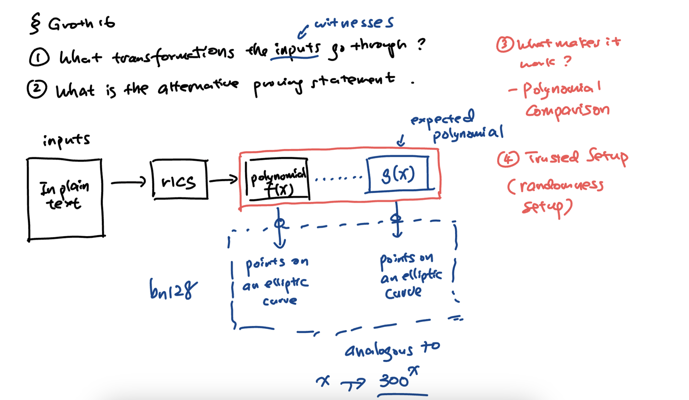
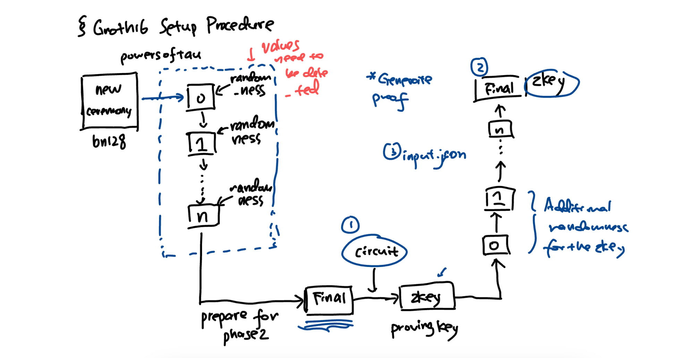

# Groth16

Groth16 是一个零知识证明系统，是由 Jens Groth 在 2016 年提出的一种高效的 zk-SNARK（零知识简洁非交互式知识参数的参数化版本）构造。zk-SNARK 是一种使得一个证明者能够在不透露它的秘密知识的情况下向验证者证明他知道某个信息的技术。Groth16 是在多个加密货币和区块链项目中广泛使用的 zk-SNARK 的变种之一。

## 作用

Groth16 的主要优点是它非常高效，尤其是在证明的生成和验证方面。具体来说：

1. **小的证明大小**：Groth16 生成的证明非常小，可以快速传输和验证。
2. **快速的验证时间**：Groth16 证明的验证时间比先前的 zk-SNARK 构造要快。
3. **可信任的设置**：与所有 zk-SNARK 构造一样，Groth16 需要一个初始的可信任的设置。在这个过程中，生成一对公私钥，私钥用于构造证明，然后必须被销毁。

### 例子：

假设 Alice 想向 Bob 证明她知道某个私有交易的秘密，例如，她知道一个满足特定哈希值的预映像，但是她不想透露这个预映像是什么。

1. **可信任的设置**：首先进行一次可信任的设置，生成公共参数。
2. **证明的构造**：Alice 使用她的私有信息（例如，一个秘密数字或交易的详细信息）和公共参数来构造一个 Groth16 证明。这个证明编码了 Alice 知道秘密的事实，但没有泄露任何关于秘密本身的信息。
3. **证明的验证**：Bob 接收到 Alice 的证明，并使用相同的公共参数来验证证明。如果证明验证通过，Bob 就可以确信 Alice 确实知道那个秘密，尽管 Bob 并不知道秘密的具体内容。

在区块链应用中，这可以用于各种场景，例如，在一个隐私币（如 Zcash）中，Alice 可以证明她拥有足够的资金进行交易，而不需要公开显示她账户的余额或交易的细节。这样一来，交易的隐私性得以保护，同时保持了区块链网络的完整性和安全性。

这张图片展示的是零知识证明系统中的一个可信设置（Trusted Setup）的过程，特别是 Groth16 证明系统的设置过程。可信设置是创建零知识证明所必需的一个步骤，它为证明的生成和验证提供了一套公共参数。

图片中列出了以下步骤：

1. **新的典礼（new ceremony）**：这指的是启动一个新的多方参与的可信设置过程。这里提到的 **`bn128`** 是指使用了 **`bn128`** 椭圆曲线的密码学参数集。
2. **powersoftau**：这是一个多方参与的可信设置的首个阶段，旨在为后续的 zk-SNARKs（零知识简洁非交互式知识论证）协议生成公共参考字符串（Common Reference String, CRS）。它通常需要多个参与者依次对参数集进行处理，增加随机性。
3. **随机性（randomness）**：在 powersoftau 过程中，每个参与者将会向参数集添加随机性。这是通过对已有参数进行某种形式的密码学操作来实现的，例如，可能是通过使用他们的秘密值来对参数进行指数化运算。
4. **Values need to be destroyed/ed**：这是说明，为了确保系统的安全性，每个参与者在向参数集中添加随机性后，需要销毁或遗忘他们的秘密值。这样，即使某个参与者不诚实，系统的安全性也不会受到威胁，因为没有人知道整个参数集的构造。
5. **准备第二阶段（prepare for phase 2）**：在第一阶段结束后，系统需要准备进入下一个阶段，即为特定的证明协议（如 Groth16）生成所需的参数。
6. **Finalize the CRS for Groth16**：最终，将完成的参数集锁定为 Groth16 协议的公共参考字符串，这将用于构建和验证证明。

整个过程强调了随机性的重要性，并且需要所有参与者的秘密值在贡献随机性后被销毁。这是为了确保系统中没有人能够完全了解 CRS 的构造，从而保证了零知识证明的安全性和可信度。

在“powers of tau”这种多方参与的可信设置协议中，需要多个参与者的参与。每个参与者轮流对当前的参数集添加自己的秘密随机值，然后将结果传递给下一个参与者。这样，每一位参与者都对公共参考字符串（CRS）增加了一层随机性。

这个过程的关键之处是，每位参与者都必须在贡献自己的随机值之后销毁它。如果所有参与者都诚实地销毁了他们的秘密值，那么最终没有任何人能够单独重构出完整的 CRS。这是因为 CRS 的最终形式是所有参与者贡献随机性的一个合成结果，除非所有参与者都合谋，并且每个人都保存了自己的秘密信息，否则 CRS 的完整构造是不可能被知道的。这样的设计是为了增加系统的安全性，使得即使有个别不诚实的参与者，也不会破坏整个系统的安全性。

这张图片展示的是一个零知识证明（ZKP）的生成过程，可能是在区块链或密码学应用中的一个环节。这个过程通常包含几个关键步骤和元素。以下是基于图片内容的详细逻辑步骤：

1. **电路（Circuit）**：
   - 这是零知识证明的起点，通常指的是一个算术电路或布尔电路，它定义了需要证明的陈述或计算任务。电路会指定输入如何转换为输出。
2. **证明密钥（zkey/proving key）**：
   - 从电路生成的信息被用来生成证明密钥。这个密钥包含了生成零知识证明所需的信息。
   - “Final”可能表示这个生成过程的最终结果或者是最终版的证明密钥。
3. **附加随机性（Additional randomness for the zkey）**：
   - 图片中的数字 1，2，...，n 代表了可能的多个阶段或多个参与者贡献随机性到证明密钥中。
   - 这个过程可能是指可信设置过程中的“powers of tau”协议，其中参与者们按顺序添加随机性到公共参考字符串中。
4. **输入文件（input.json）**：
   - 在生成证明之前，需要提供一个包含所有必要输入的文件，这通常是一个 JSON 格式的文件。
   - 这个输入文件包含了证明过程所需的所有数据，它对应于上述电路的输入。
5. **生成证明（Generate proof）**：
   - 一旦证明密钥和输入数据都准备好了，下一步就是生成证明本身。
   - 这个证明将会证实输入数据满足电路定义的条件，而无需透露输入数据的具体内容。
6. **验证密钥（zkKey）**：
   - “Final zkKey”可能指的是验证密钥的最终版本，这是验证零知识证明的关键组成部分。
   - 生成证明后，任何人都可以使用这个验证密钥来验证证明的正确性，而无需了解证明中隐藏的信息。

整个流程图展示的是从定义证明需求的电路到生成和验证零知识证明所需的步骤。零知识证明是密码学中的一个重要工具，它允许证明者向验证者证明他们知道某个信息，而无需透露该信息本身。这在提供隐私保护的同时验证交易或其他数据的真实性方面非常有用。
